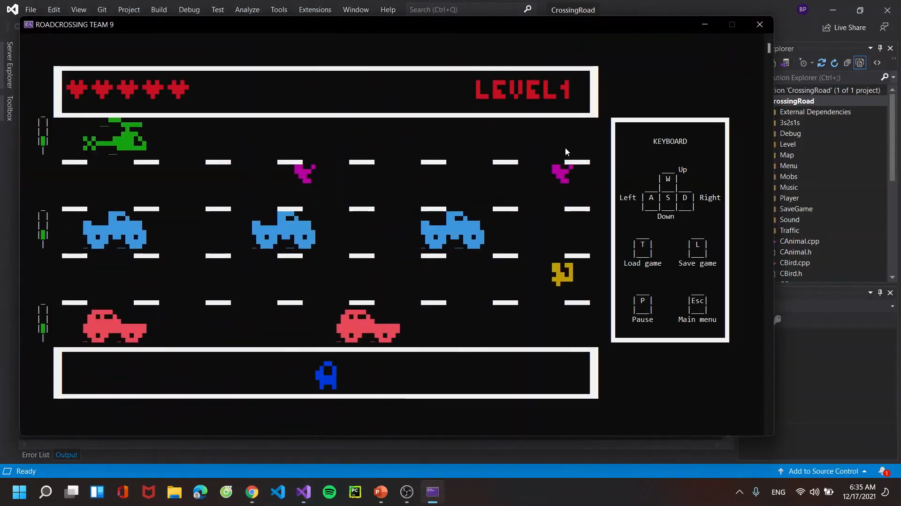

# Crossing Road game
This is a game project in OOP (Object Oriented Programming) course, in Ho Chi Minh University of Science
This is a classic game where the player has to control a character to cross the road so as not to hit the obstacles and will pass the level if the player crosses the road safely.

## How to run?
You can clone the project by the following command
```bash
git clone https://github.com/PhuongBui712/Crossing_Road.git
```
or you can download it directly from green button on Github page  
After downloading, just excecute the program and run it!
  

## Demo
You can watch demo video [here](https://youtu.be/sKwQsDRi4Ps)